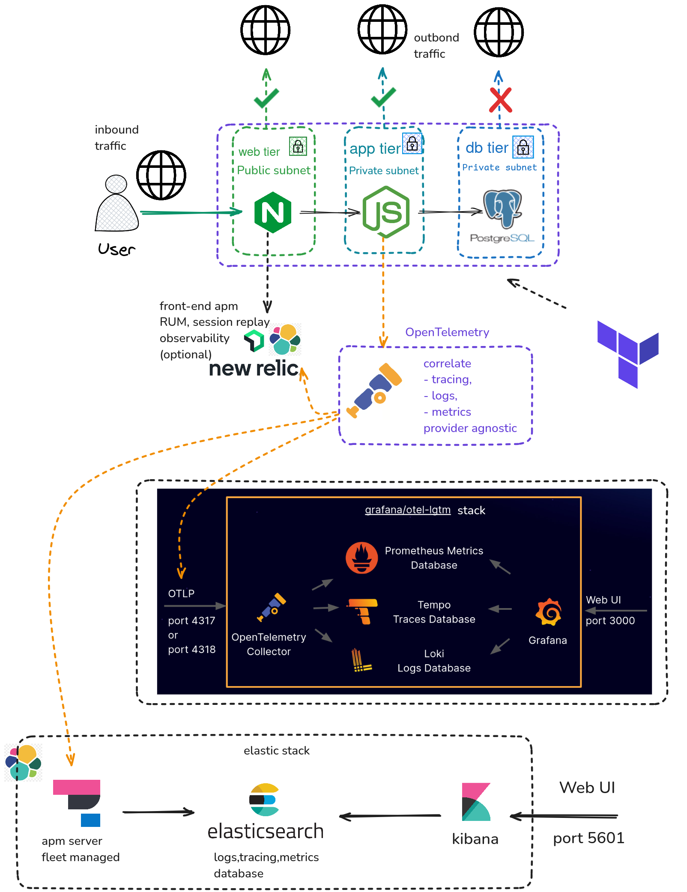

#Running
with terraform:
```
git clone https://github.com/leo-the-nardo/cubos-devops.git
cd cubos-devops
cd terraform
terraform init
terraform apply -var-file="values.example.tfvars" 
```
with docker compose:
```
git clone https://github.com/leo-the-nardo/cubos-devops.git
cd cubos-devops
mv .env.example .env
docker compose up -d
```

```
https://localhost
```